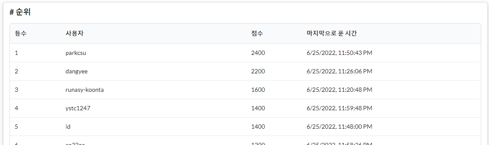

# KHU CTF Write-Up(parkcsu)



# Download

## 1. 문제 설명

Python의 Flask 프레임워크 중 send_file을 이용해 GET으로 요청받은 경로의 파일을 제공하는 서비스이다.

## 2. 취약점

### Path transversal attack

send_file의 경우 Path transversal attack이 가능하다. 따라서 요청을 다음과 같이 작성해 원하는 임의의 파일을 다운로드 받을 수 있다.

`link_to_site/download?name=/etc/passwd`

따라서 name 파라메터의 경로가 `downloads/` 로 시작하는지 확인하는 부분을 코드에 추가했다.

```python
@download.route("/", methods=["GET"])
def index():
    name = request.args.get("name", default=None)
		# parkcsu - Add path check for download path
    if not str(name).startswith('downloads/') or not name:
        return ""
    else:
        try:
            return send_file(name, as_attachment=True)
        except FileNotFoundError:
            return "파일이 없습니다."
```

`downloads/../../../../../etc/passwd` 와 같은 방식으로 위 코드 또한 우회할 수 있으나, 이 문제에서는 일단 `PATCHED` 처리가 되어 운영진에게 위 테스트 케이스를 제보했다.

# Semi Shell

## 1. 문제 설명

C로 작성된 간단한 Shell이며 유저, 파일 생성/읽기/수정을 지원한다.

## 2. 취약점

### strncmp

```c
int checkUser(char *u1, char *u2) {
    int len;
    int ret = 0;
    len = strlen(u1);
    if(strncmp(u1, u2, len)) ret = 1;
    return ret;
    // aaa 유저가 aa 유저의 파일을 수정 가능. -> 함수를 strcmp로 수정하거나 둘 중 더 긴 username으로 비교.
}
```

strncmp는 두 string을 비교할 때, 세번째 파라메터로 제공된 길이 만큼만 비교하기 때문에 위와 같이 길이가 다르고 한 username이 앞에 다른 username을 포함하는 경우 user check가 작동하지 않는다.

```c
int checkUser(char *u1, char *u2) {
    int ret = 0;
    // parkcsu - fixed string check
    int len1, len2;
    len1 = strlen(u1);
    len2 = strlen(u2);
    if(strncmp(u1, u2, len1) || len1 != len2) ret = 1;
    return ret;
    // aaa 유저가 aa 유저의 파일을 수정 가능. -> 함수를 strcmp로 수정하거나 둘 중 더 긴 username으로 비교.
}
```

strcmp를 사용해서도 해결할 수 있지만 두 string의 길이를 비교하는 코드를 추가하는 방식으로 패치했다.

### No null check for username

```c
int addUser(char *username) {           // Don't NULL check to username (NULL일경우에는 작업 X하고 return -1 해서 원래 terminal로 복귀하도록 patch(다른 함수들 참조))
    if(strlen(username) > 0x8) 
        printf("adduser: %s is too long...\n", username);
    if(USER_CNT >= 8)
        puts("adduser: User pool is already full...");
    else if(searchUser(username) != -1) {
        printf("adduser: %s: already exist username...\n", username);
    } else {
        USERS[USER_CNT++] = strdup(username);
        printf("adduser: %s is succesfully created!\n", username);
    }
    return 0;
}
```

username이 NULL일경우 null pointer에 접근하는 과정에서 오류가 발생할 수 있기 때문에 NULL인지 확인하는 코드를 추가했다.

```c
int addUser(char *username) {           // Don't NULL check to username (NULL일경우에는 작업 X하고 return -1 해서 원래 terminal로 복귀하도록 patch(다른 함수들 참조))
    // parkcsu - add null check for username
    if(!username) return -1;
    if(strlen(username) > 0x8) 
        printf("adduser: %s is too long...\n", username);
    if(USER_CNT >= 8)
        puts("adduser: User pool is already full...");
    else if(searchUser(username) != -1) {
        printf("adduser: %s: already exist username...\n", username);
    } else {
        USERS[USER_CNT++] = strdup(username);
        printf("adduser: %s is succesfully created!\n", username);
    }
    return 0;
}
```

### Not closing FP after using it

**note: 성공적으로 패치했나 확인되진 않지만 밑의 stack size bof와 이것  둘 중 하나는 확실히 맞았습니다**

```c
int fileOpen(char *filename) {
    char *pos = filename;
    int fileIdx;
    if(!filename) { 
        fileIdx = -1;
        if(FD != -1) _close();
    } else {
        ACUT(pos);
        *pos = '\0';
        if(strlen(filename) > 0x8) { 
            printf("open: %s is too long...\n", filename);
            fileIdx = -1;
            if(FD != -1) _close();
        } else {
            fileIdx = searchFile(filename);
            if(fileIdx == -1) {
                printf("open: %s: No such file or directory\n", filename);
                if(FD != -1) _close();
            } else {
                if(checkUser(USER, FILES[fileIdx].owner)) {
                    printf("open: %s: Permission denined.\n", filename);
                    fileIdx = -1;
                    if(FD != -1) _close();
                } else {
                    // 여기에 FD가 -1이 아닐 경우 close가 추가돼야 함.
                    _open(filename);
                    puts("open: open success.");
                }
            }
        }
    }
    FD = fileIdx;
    return FD; // 이미 FD가 존재하면 open 되어있는 file을 close후에 open을 진행하도록 패치해야한다. -> 안 그러면 filebuffer에 적힌 내용이 모두 사라져서 수정한 내용이 저장되지 않음.
}
```

보안 상 어떤 문제를 일으키는지 확실하진 않으나, 주석의 내용대로 코드를 수정했다.

```c
int fileOpen(char *filename) {
    char *pos = filename;
    int fileIdx;
    if(!filename) { 
        fileIdx = -1;
        if(FD != -1) _close();
    } else {
        ACUT(pos);
        *pos = '\0';
        if(strlen(filename) > 0x8) { 
            printf("open: %s is too long...\n", filename);
            fileIdx = -1;
            if(FD != -1) _close();
        } else {
            fileIdx = searchFile(filename);
            if(fileIdx == -1) {
                printf("open: %s: No such file or directory\n", filename);
                if(FD != -1) _close();
            } else {
                if(checkUser(USER, FILES[fileIdx].owner)) {
                    printf("open: %s: Permission denined.\n", filename);
                    fileIdx = -1;
                    if(FD != -1) _close();
                } else {
                    // 여기에 FD가 -1이 아닐 경우 close가 추가돼야 함.
                    // parkcsu - add close in front in case the file is already open
                    if(FD != -1) _close();
                    _open(filename);
                    puts("open: open success.");
                }
            }
        }
    }
    FD = fileIdx;
    return FD; // 이미 FD가 존재하면 open 되어있는 file을 close후에 open을 진행하도록 패치해야한다. -> 안 그러면 filebuffer에 적힌 내용이 모두 사라져서 수정한 내용이 저장되지 않음.
}
```

### Stack based buffer overflow & Logic error

```c
int fileRead(char *pos) { // FD가 -1일 때, 검사를 진행해야함. 안 그러면 OOB 발생.
    char buffer[0x80]; // FILE buffer가 File content보다 작아서 stack based bof발생. buffer 크기 증가시키는 patch가 필요함.

    unsigned int size;
    memset(buffer, 0, sizeof(buffer));
    if(!pos) return -1;
    size = atoi(pos);
    if(FILE_POS + size > FILES[FD].size) {
        puts("read: Size is to large...");
        return 0;
    }
    _read(buffer, size);
    memcpy(buffer, &FILE_BUF[FILE_POS - size], size);
    printf("%s(%s): ", FILES[FD].name, FILES[FD].owner);
    for(int i = 0; i < size; ++i) {
        if(i % 10 == 0) putchar('\n');
        printf("%02hhx ", buffer[i]);
    }
    putchar('\n');
    puts("read: read success.");
    return 0;
}
```

다음은 `fileWrite()` 함수의 일부이다.

```c
char buffer[0x100];
memcpy(buffer, data, size);
_write(buffer, size);
```

`fileWrite()` 에서 허용되는 최대 file size는 char[0x100]임에 반해, `fileRead()` 의 buffer은 char[0x80]이라 stack based BOF가 발생할 수 있다. 

`fileRead()` 의 버퍼 크기를 0x100으로 수정했고, file이 open되지 않은 상황에서 read하는 일을 방지하기 위해 `FD == -1` 인 경우 return하는 코드를 추가했다.

```c
int fileRead(char *pos) { // FD가 -1일 때, 검사를 진행해야함. 안 그러면 OOB 발생.
    // parkcsu - add FB check
    if(FD == -1)
    {
        puts("read: open first...");
        return 0;
    }

    // parkcsu - fix buffer size to match fileWrite() buffer(80->100)
    char buffer[0x200]; // FILE buffer가 File content보다 작아서 stack based bof발생. buffer 크기 증가시키는 patch가 필요함.

    unsigned int size;
    memset(buffer, 0, sizeof(buffer));
    if(!pos) return -1;
    size = atoi(pos);
    if(FILE_POS + size > FILES[FD].size) {
        puts("read: Size is to large...");
        return 0;
    }
    _read(buffer, size);
    memcpy(buffer, &FILE_BUF[FILE_POS - size], size);
    printf("%s(%s): ", FILES[FD].name, FILES[FD].owner);
    for(int i = 0; i < size; ++i) {
        if(i % 10 == 0) putchar('\n');
        printf("%02hhx ", buffer[i]);
    }
    putchar('\n');
    puts("read: read success.");
    return 0;
}
```

# Key Management

## 1. 문제 설명

최대 512자리 문자열(널문자 포함), 64자리 숫자 (널문자 포함)의 키를 만들고 관리하는 형태의 프로그램이며, 내부에서 Separate chaining hash table 알고리즘을 사용한다.

## 2. 취약점

### gets

gets는 최대 input size에 제한이 없으며, char data[64]에 사이즈 이상의 문자열을 입력하여 buffer overflow를 시도할 수 있다. 따라서 코드에 있는 gets를 fgets로 수정해 이를 방지했다.

```c
// success on 0, failure on -1. don't change function return value!!
int generate_key(const char* key, const int type) {
	char data[512];
	if (type > String) {
		return -1;
	}

	int hash = hashing(key);
	struct entry_t* entry = malloc(sizeof(struct entry_t));
	entry->type = type;
	entry->key = key;
	switch (type) {
	case Decimal:
		printf("value(Decimal): ");
		entry->data.d = input_decimal();
		break;
	case String:
		printf("value(String): ");
		// parkcsu - possible OOB
		fgets(data, 64, stdin);
		entry->data.s = malloc(strlen(data) + 1);
		strcpy(entry->data.s, data);
		break;
	}

	entry->next = list[hash];
	list[hash] = entry;
	return 0;
}

// success on 0, failure on -1. don't change function return value!!
int modify_key(const char* key, const int type) {
	char data[512];
	struct entry_t* entry = find_entry(key);
	if (!entry) {
		return -1;
	}
	if (type == Decimal && entry->type == Decimal) {
		printf("value(Decimal): ");
		entry->data.d = input_decimal();
		return 0;
	}
	else if (type == String && entry->type == String) {
		free(entry->data.s);
		printf("value(String): ");
		// parkcsu - possible OOB
		fgets(data, 64, stdin);
		entry->data.s = malloc(strlen(data) + 1);
		strcpy(entry->data.s, data);
		return 0;
	}
	return -1;
}
```

### No type check for view_key, modify_key, delete_key

위 세 함수는 type을 파라메터로 받고 이는 사용자의 input에서 지정되는 인자이다. 만약 이 type이 실제 키의 type과 다를 경우 프로그램이 오작동 할 수 있기에 entry_t에 키의 type을 추가하여 정보 변경 시 타입을 확인하는 코드를 추가했다.

```c
struct entry_t {
	char* key;
	enum type_t type;
	union data_t data;
	struct entry_t* next;
};

// success on 0, failure on -1. don't change function return value!!
int generate_key(const char* key, const int type) {
~~~
	entry->key = key;
~~~
}

// success on 0, failure on -1. don't change function return value!!
int delete_key(const char* key, const int type) {
~~~
	if (entry->type != type) return -1;

	if (type == String) {
		free(entry->data.s);
	}
~~~
}

// success on 0, failure on -1. don't change function return value!!
int modify_key(const char* key, const int type) {
	if (type == Decimal && entry->type == Decimal) {
~~~
	}
	else if (type == String && entry->type == String) {
~~~
	}
	return -1;
}

// success on 0, failure on -1. don't change function return value!!
int view_key(const char* key, const int type) {
~~~
	if (type == Decimal && entry->type == Decimal) {
		printf("value(Decimal): %d\n", entry->data.d);
		return 0;
	}
	else if (type == String && entry->type == String) {
		printf("value(String): %s\n", entry->data.s);
		return 0;
	}
	return -1;
}

// success on 0, failure on -1. don't change function return value!!
int copy_key_data(const char* key, const char* dest_key) {
~~~
	result->type = entry->type;
~~~
}
```

# KHU Archive

## 1. 문제 소개

Huffman encoding/decoding으로 주어진 파일을 압축하는 C++ 프로그램이다.

## 2. 취약점

### strcpy

다음은 append 함수의 일부이다.

```cpp
int append(PARCHIVE archive, string filename)	
{	
    int ret = 0;	
    string buf;	
    uint32_t size;	
    FILE* file = fopen(filename.c_str(), "rb");	
    if (file == NULL) {	
        cout << "File open error!" << endl;	
        return -1;	
    }	
    uint32_t file_size = getFileSize(file);	
    fclose(file);	
    if (file_size > 10485760) // size < 10MB	
    {	
        cout << "File Size < 10MB" << endl;	
        return -1;	
    }	
    Compression(filename, buf);	
    size = buf.length();	
    PFILE_DESC desc = new FILE_DESC;	
    memset(desc, 0, sizeof(FILE_DESC));	
    strcpy(desc->name, filename.c_str());	
    desc->size = size;
~~~
}
```

이 중 `strcpy(desc->name, filename.c_str());`에서 문자열의 크기를 지정해주지 않아 buffer overflow 취약점이 발생할 수 있다. 따라서 이를 확인하는 코드를 추가했다.

```cpp
PFILE_DESC desc = new FILE_DESC;
memset(desc, 0, sizeof(FILE_DESC));
if (filename.length() > sizeof(desc->name) - 1) return -1;
strcpy(desc->name, filename.c_str());
```

다음은 main 함수의 일부이다.

```cpp
else if (argc > 2)	
{	
    strcpy(command_, argv[1]);	
    strcpy(filename_, argv[2]);	
    string filename(filename_);	
    string command(command_);
~~~
}
```

여기서 command_와 filename_은 길이 제한을 가지는 char* 문자열이고, argv는 std::string으로 이루어진 배열이다. 따라서 argv가 C 문자열의 길이보다 클 경우, out of bounds 오류가 일어날 수 있기 때문에 문자열의 길이를 체크하는 코드를 추가했다.

```cpp
else if (argc > 2)
{
    if (strlen(argv[1]) > CMAX - 1 || strlen(argv[2]) > FMAX - 1) return 0;
    strcpy(command_, argv[1]);
    strcpy(filename_, argv[2]);
    string filename(filename_);
    string command(command_);
~~~
}
```

## Format string

Formatting이 없는 printf로 프로그램의 내부 메모리 구조를 확인 및 변조할 수 있다.

```cpp
void file_list(PARCHIVE archive)	
{	
    cout << "File List:" << endl;	
    PFILE_NODE curr = archive->fileList.next;	
    while (curr != NULL)	
    {	
        printf(curr->desc.name);	
        curr = curr->next;	
        puts("");	
    }	
}
```

따라서 %s 포멧을 넣어주어 버그를 수정했다.

```cpp
void file_list(PARCHIVE archive)
{
    cout << "File List:" << endl;
    PFILE_NODE curr = archive->fileList.next;
    while (curr != NULL)
    {
        printf("%s", curr->desc.name);
        curr = curr->next;
        puts("");
    }
}
```